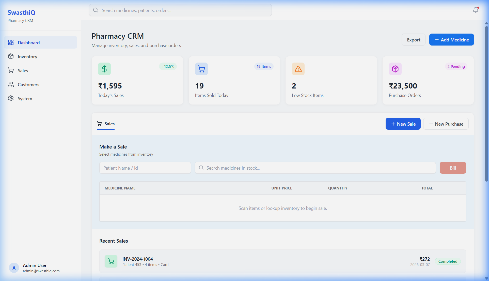
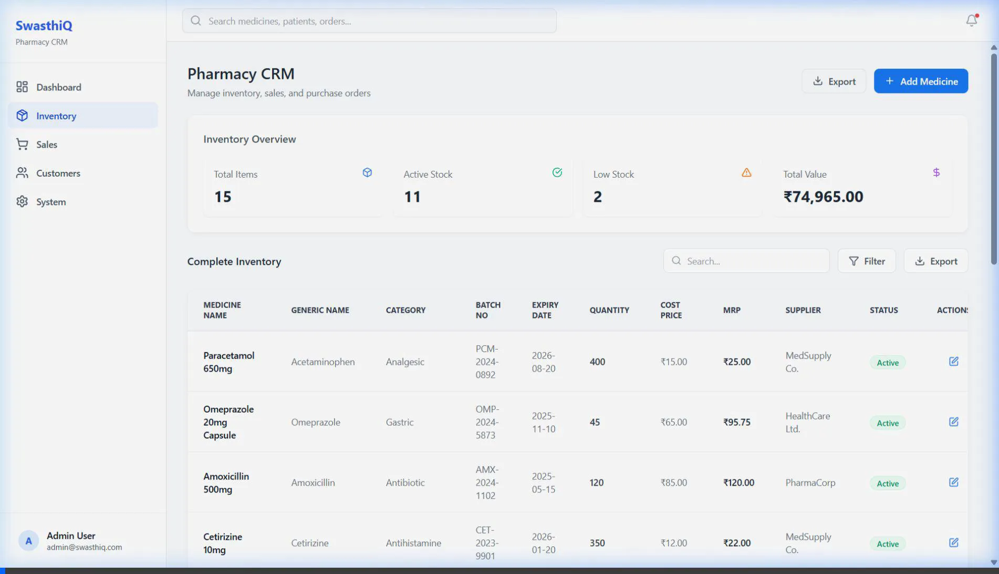

# 💊 Pharmacy CRM - Management System

> **Live Demo**: [Link](https://pharmacy-crm-yourlink.vercel.app/)

Hey there! Thanks for checking out my submission for the Pharmacy CRM assignment. 

I’ve built this application with a focus on **data integrity**, **developer experience**, and a **clean, modern UI**. My goal was to create a tool that isn't just a basic CRUD app, but something that actually solves real-world problems for a pharmacist—like preventing accidental sales of out-of-stock items or catching invalid data before it hits the logs.

## 🚀 Quick Visual Tour

### Dashboard Overview
The dashboard gives you a snapshot of daily performance at a glance. I've included metrics for Sales, Items Sold, Low Stock alerts, and pending Purchase Orders.



### Inventory Management & Stock Updates
A clean, searchable table for managing your stock. I've designed this to be highly reactive—when you update a medicine's quantity, the system automatically re-calculates its status and updates the global inventory health metrics.

#### 🎥 Feature Demo: Stock Update Flow
In the demo below, you can see **Atorvastatin 10mg** being updated from 'Low Stock' (8 units) to 'Active' (85 units). Notice how the status badge changes instantly and the 'Low Stock' count in the overview card decreases.



---

## 🛠️ The Tech Stack

I chose a modern, scalable stack to ensure the app is fast and easy to maintain:
- **Backend**: FastAPI (Python 3.10+) for a high-performance REST API.
- **Frontend**: React (Vite) for a snappy, responsive UI, styled with Tailwind CSS.
- **Database**: SQLite with SQLAlchemy for reliable, structured data.
- **Validation**: Pydantic for bulletproof input checks.

---

## 📐 REST API Structure

I designed the API to be predictable and modular. The project is split into a clear `/backend` and `/frontend` structure.

### 1. Inventory Endpoints
- `GET /api/inventory/medicines`: Fetches all medicines. Supports pagination (`skip`, `limit`).
- `POST /api/inventory/medicines`: Adds a new medicine. 
- `PUT /api/inventory/medicines/{id}`: Updates an existing medicine. 
- `PATCH /api/inventory/medicines/{id}/status`: Quick update for stock status.

### 2. Dashboard & POS Endpoints
- `GET /api/dashboard/summary`: Aggregates real-time stats (today's sales, low stock counts).
- `GET /api/dashboard/recent-sales`: Fetches the latest transactions.
- `POST /api/dashboard/sales`: The core POS logic. It validates stock, deducts inventory, and records the sale in a single transaction.

---

## 🔒 Data Consistency & Python Logic

One of the most important parts of this project was ensuring **data consistency**. I didn't want the user to have to manually update "Status" flags—that's how mistakes happen.

### Automatic Status Calculation
In `backend/schemas.py` and the medicine update logic, I implemented a system where the `status` (`Active`, `Low Stock`, `Out of Stock`) is derived directly from the `quantity`.
- If `quantity == 0` → **Out of Stock**
- If `quantity <= 10` → **Low Stock**
- Otherwise → **Active**

### Validation & Integrity
- **Pydantic Validation**: I added strict rules to ensure that nobody can enter a negative price, a negative quantity, or an "Expiry Date" that is in the past. 
- **MRP vs Cost Price**: A custom validator ensures the MRP is never lower than the Cost Price, protecting the pharmacy's margins.
- **Backend-First Consistency**: The backend recalculates these states on every `PUT` or `POST`. Even when you are just updating the stock quantity, the system re-evaluates the medicine's status to ensure your inventory health is always accurate.

---

## 🎨 Special Features I Added

- **Update Medicine / Stock Management**: I added a full "Update Medicine" flow. You can edit any existing medicine's details—like increasing the stock quantity of a specific batch—and the system will automatically update the status (e.g., from 'Low Stock' back to 'Active').
- **Smart Search & Filters**: Quickly find medicines by name, generic name, or batch number.
- **Toast Notifications**: Replaced browser alerts with smooth `react-hot-toast` notifications for a premium feel.
- **Database Seeder**: I wrote a `seed.py` script so you don't have to start with an empty app. It populates everything with 15+ realistic medicines and sale data.
- **Professional Setup**: Included a root `.gitignore` and a clean `requirements.txt` to keep the repo clean and easy to clone.

---

## 🏃‍♂️ Getting Started

### 1. Backend Setup
```bash
# Navigate to backend
cd backend

# Install dependencies
pip install -r requirements.txt

# Seed the database (Important!)
python seed.py

# Start the server
uvicorn main:app --reload
```

### 2. Frontend Setup
```bash
# Navigate to frontend
cd frontend

# Install & Run
npm install
npm run dev
```

---

## ☁️ Live Deployment Note

This project is configured for deployment on **Vercel**. 

> **Important**: Because the application uses **SQLite** for simplicity in this assignment, the database in the live environment is ephemeral. This means that data added via the live link will be reset when the serverless instance restarts. For a persistent experience, please follow the **Local Setup** guide above.

---

Thanks again for the opportunity! I'd love to jump on a call and explain any part of the architecture in more detail.
